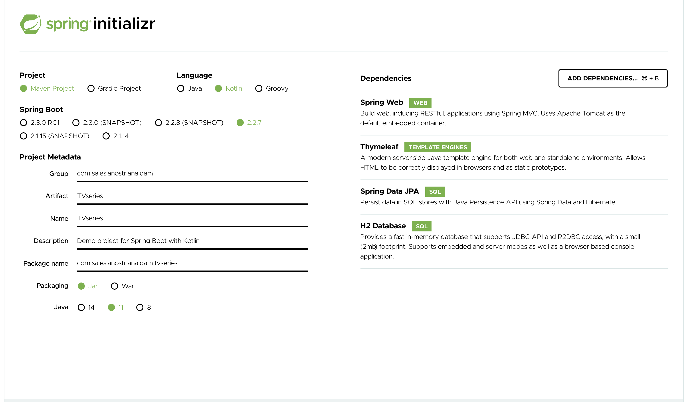

# TV Series - Ejemplo de creación de una API REST con Spring Boot y Kotlin

> Este tutorial está basado en [https://github.com/spring-guides/tut-spring-boot-kotlin](https://github.com/spring-guides/tut-spring-boot-kotlin)

Si estás comenzando con Kotlin, puedes aprender más sobre el lenguaje en:

- Documentación de referencia: [https://kotlinlang.org/docs/reference/](https://kotlinlang.org/docs/reference/)
- Los tutoriales Koans: [https://play.kotlinlang.org/](https://play.kotlinlang.org/)

El soporte de Spring Boot para Kotlin está bien documentado en la documentación de referencia.

- Spring Framework: [https://docs.spring.io/spring/docs/current/spring-framework-reference/languages.html#kotlin](https://docs.spring.io/spring/docs/current/spring-framework-reference/languages.html#kotlin)
- Spring Boot: [https://docs.spring.io/spring-boot/docs/current/reference/html/spring-boot-features.html#boot-features-kotlin](https://docs.spring.io/spring-boot/docs/current/reference/html/spring-boot-features.html#boot-features-kotlin)

## Creación de un nuevo proyecto

Lo podemos hacer mediante varias vías. En este caso, utilizamos la primera de ellas.

### Uso de Spring Initialzr

A través de [https://start.spring.io](https://start.spring.io) podemos generar nuestro proyecto, escogiendo **Kotlin** como lenguaje. _Gradle_ suele ser el más usado con Kotlin, aunque por mantener compatibilida con lo estudiado durante el curso, utilizaremos Maven.



El proyecto se descarga en un fichero .zip que, tras ser descomprimido, puede ser importado desde tu IDE favorito. 

### A través de la línea de comandos

También se podría generar usando la línea de comandos

```bash
mkdir tvseries && cd tvseries
curl https://start.spring.io/starter.zip -d language=kotlin -d style=web,thymeleaf,jpa,h2 -d package=com.salesianostriana.dam.tvseries -d name=TVSeries -o tvseries.zip
```

### A través de Intellij IDEA Ultimate

Como sucede con Spring Tool Suite sobre Eclipse, la versión Ultimate de IDEA también incorpora el asistente de Spring Initilizr, que nos permite realizar la generación del proyecto desde el IDE.

> Recuerda que la versión Ultimate es de pago.

## Entendiendo el código generado

### Maven

#### Plugins

El primer plugin que podemos ver es [plugin de Kotlin para Maven](https://kotlinlang.org/docs/reference/using-maven.html). Además, se incluye el muy importante [plugin spring-kotlin](https://kotlinlang.org/docs/reference/compiler-plugins.html#spring-support). Este plugin se encarga de que las clases con anotaciones sean por defecto `open` (normalemente en Kotlin todas las clases son `final`).

También se añade el plugin de [JPA Kotlin](), que permite utilizar propiedades no-nullables y genera constructores sin argumentos para las clases anotadas con `@Entity`, `@MappedSuperclass` o `@Embeddable`.

`pom.xml`

```xml
<build>
		<sourceDirectory>${project.basedir}/src/main/kotlin</sourceDirectory>
		<testSourceDirectory>${project.basedir}/src/test/kotlin</testSourceDirectory>
		<plugins>
			<plugin>
				<groupId>org.springframework.boot</groupId>
				<artifactId>spring-boot-maven-plugin</artifactId>
			</plugin>
			<plugin>
				<groupId>org.jetbrains.kotlin</groupId>
				<artifactId>kotlin-maven-plugin</artifactId>
				<configuration>
					<args>
						<arg>-Xjsr305=strict</arg>
					</args>
					<compilerPlugins>
						<plugin>spring</plugin>
						<plugin>jpa</plugin>
					</compilerPlugins>
				</configuration>
				<dependencies>
					<dependency>
						<groupId>org.jetbrains.kotlin</groupId>
						<artifactId>kotlin-maven-allopen</artifactId>
						<version>${kotlin.version}</version>
					</dependency>
					<dependency>
						<groupId>org.jetbrains.kotlin</groupId>
						<artifactId>kotlin-maven-noarg</artifactId>
						<version>${kotlin.version}</version>
					</dependency>
				</dependencies>
			</plugin>
		</plugins>
	</build>
```

#### Dependencias

Encontramos algunas dependencias específicas de Kotlin:

- `kotlin-stdlib-jdk8`: variante de Java 8 de la librería estándar de Kotlin.
- `kotlin-reflect`: librería para introspección (necesaria para Spring).
- `jackson-module-kotlin`: añade soporte para la serialización-deserialización de clases y _data classes_.

`pom.xml`

```xml
<dependencies>
		<dependency>
			<groupId>org.springframework.boot</groupId>
			<artifactId>spring-boot-starter-data-jpa</artifactId>
		</dependency>
		<dependency>
			<groupId>org.springframework.boot</groupId>
			<artifactId>spring-boot-starter-thymeleaf</artifactId>
		</dependency>
		<dependency>
			<groupId>org.springframework.boot</groupId>
			<artifactId>spring-boot-starter-web</artifactId>
		</dependency>
		<dependency>
			<groupId>com.fasterxml.jackson.module</groupId>
			<artifactId>jackson-module-kotlin</artifactId>
		</dependency>
		<dependency>
			<groupId>org.jetbrains.kotlin</groupId>
			<artifactId>kotlin-reflect</artifactId>
		</dependency>
		<dependency>
			<groupId>org.jetbrains.kotlin</groupId>
			<artifactId>kotlin-stdlib-jdk8</artifactId>
		</dependency>

		<dependency>
			<groupId>com.h2database</groupId>
			<artifactId>h2</artifactId>
			<scope>runtime</scope>
		</dependency>
		<dependency>
			<groupId>org.springframework.boot</groupId>
			<artifactId>spring-boot-starter-test</artifactId>
			<scope>test</scope>
			<exclusions>
				<exclusion>
					<groupId>org.junit.vintage</groupId>
					<artifactId>junit-vintage-engine</artifactId>
				</exclusion>
			</exclusions>
		</dependency>
	</dependencies>
```

### Clase `TVseriesApplication.kt`

El código es muy similar al que se hubiera generado con Java, pero aun así tiene algunas diferencias:

```java
@SpringBootApplication
class TVseriesApplication

fun main(args: Array<String>) {
	runApplication<TVseriesApplication>(*args)
}
```

- La clase está vacía.
- El método `main` está fuera de la clase.
- El método `main` es una alternativa a 

```java
SpringApplication.run(BlogApplication::class.java, *args)
```

## Persistencia con Spring Data JPA

### Entidades

Vamos a crear un fichero, llamado `Entidades.kt`, donde definiremos nuestras entidades.

```kotlin
enum class Plataforma {
    NETFLIX, HBO, MOVISTAR, DISNEY, AMAZON
}

@Entity
data class Serie(
        var nombre: String,
        var fechaEstreno: LocalDate,

        @Enumerated(EnumType.STRING) var plataforma: Plataforma,
        var numeroTemporadas: Int,


        @Id @GeneratedValue val id: UUID? = null,

        @JsonManagedReference
        @OneToMany(mappedBy="serie", fetch = FetchType.LAZY, cascade = [CascadeType.REMOVE])
        var capitulos : List<Capitulo>? = null

)

@Entity
data class Capitulo(
        var nombre: String,
        var fechaEstreno: LocalDate,
        @JsonBackReference @ManyToOne var serie: Serie? = null,
        @Id @GeneratedValue val id: UUID? = null
)
```

> Existe mucho debate sobre la conveniencia o no de utilizar _data classes_ a la hora de implementar entidades, sobre todo en las primeras versiones de Kotlin y antes de que se publicara el plugin de JPA. Nosotros las vamos a utilizar porque responden a nuestras necesidades. Os remito a que podáis investigar sobre el tema.

### Repositorios

> Soy de la opinión de no utilizar los repositorios directamente en los controladores, creando siempre una capa de servicios. En este ejemplo no lo haremos para mantenar la simplicidad del mismo.

Estos podrían ser nuestros repositorios. Nótese que se incluyen algunas consultas para poder localizar las series sin capítulos o también con capítulos.

```kotlin
interface SerieRepository : JpaRepository<Serie, UUID> {

    @Query("select distinct s from Serie s left join fetch s.capitulos")
    fun findAllConCapitulos() : List<Serie>

    @Query("select distinct s from Serie s left join fetch s.capitulos where s.id = :id")
    fun findByIdConCapitulos(id:UUID) : Optional<Serie>

}

interface CapituloRepository : JpaRepository<Capitulo, UUID> {

}
```

Creamos también un componente para incializar algunos datos de ejemplo:

```kotlin
@Component
class InitDataComponent(
        val serieRepository: SerieRepository,
        val capituloRepository: CapituloRepository
) {

    @PostConstruct
    fun initData()  {
        var serie1 = Serie("El Mandaloriano", LocalDate.of(2019, 11, 12), Plataforma.DISNEY,1)
        serieRepository.save(serie1)

        var serie1capitulos = listOf(
                Capitulo("1x01 Capitulo Uno", LocalDate.of(2019, 11, 12), serie1),
                Capitulo("1x02 El niño", LocalDate.of(2019,11,15), serie1),
                Capitulo("1x03 El pecado", LocalDate.of(2019,11,22), serie1),
                Capitulo("1x04 El santuario", LocalDate.of(2019, 11, 29), serie1),
                Capitulo("1x05 El pistolero", LocalDate.of(2019, 12, 6), serie1),
                Capitulo("1x06 El prisionero", LocalDate.of(2019, 12, 13), serie1),
                Capitulo("1x07 Ajuste de cuentas", LocalDate.of(2019, 12, 18), serie1),
                Capitulo("1x08 Redención", LocalDate.of(2019, 12, 27), serie1)
        )

        capituloRepository.saveAll(serie1capitulos)


        var serie2 = Serie("The Witcher", LocalDate.of(2019, 12, 20), Plataforma.NETFLIX, 1)
        serieRepository.save(serie2)

        val fechaComun = LocalDate.of(2019, 12, 20)
        var serie2capitulos = listOf(
                Capitulo("1x01 Principio del fin", fechaComun, serie2),
                Capitulo("1x02 Cuatro marcos", fechaComun, serie2),
                Capitulo("1x03 Luna traicionera", fechaComun, serie2),
                Capitulo("1x04 Banquetes, bastardos y entierros", fechaComun, serie2),
                Capitulo("1x05 Apetitos incontenibles", fechaComun, serie2),
                Capitulo("1x06 Especies raras", fechaComun, serie2),
                Capitulo("1x07 Antes de la caída", fechaComun, serie2),
                Capitulo("1x08 Mucho más", fechaComun, serie2)
        )
        capituloRepository.saveAll(serie2capitulos)
    }

}
```


### Controladores

Vamos a vehicular todo el ejemplo a partir de un solo controlador, donde añadiremos todos los métodos.

> Todos los métodos de este controlador tendrán como ruta raíz `/series`.

### Métodos GET

Vamos a proporcionar a nuestros usuarios una ruta para obtener todas las series sin capítulos, y también con todos sus capítulos. Análogamente haremos lo mismo para la búsqueda de una serie.

Para evitar problemas con Jackson y el _fetching_ de tipo lazy, podemos crear algunos DTOs, para enviar estrictamente los datos que sean necesarios.

#### Data Transfer Object

Creamos un nuevo fichero donde colocar todos nuestros DTOs y algunas funciones de extensión

```kotlin
data class SerieDTO(
        val id: UUID?,
        val nombre: String,
        @JsonFormat(shape = JsonFormat.Shape.STRING, pattern = "dd/MM/yyyy")
        val fechaEstreno: LocalDate,
        val plataforma: Plataforma,
        val numeroTemporadas : Int
        )

fun Serie.toSerieDTO() = SerieDTO(id, nombre, fechaEstreno, plataforma, numeroTemporadas)

fun SerieDTO.toSerie() = Serie(nombre, fechaEstreno,plataforma, numeroTemporadas, id)

data class NuevaSerieDTO(
        val nombre: String,
        @JsonFormat(shape = JsonFormat.Shape.STRING, pattern = "dd/MM/yyyy")
        val fechaEstreno: LocalDate,
        val plataforma: Plataforma,
        val numeroTemporadas : Int
)

fun NuevaSerieDTO.toSerie() = Serie(nombre, fechaEstreno, plataforma, numeroTemporadas)


data class CapituloDTO(
        val id : UUID?,
        val nombre: String,
        @JsonFormat(shape = JsonFormat.Shape.STRING, pattern = "dd/MM/yyyy")
        val fechaEstreno: LocalDate
)

fun Capitulo.toCapituloDTO() = CapituloDTO(id, nombre, fechaEstreno)

fun CapituloDTO.toCapitulo() = Capitulo(nombre, fechaEstreno, null, id)

```

### Agrupando funcionalidad

La funcionalidad de obtener todas las series con o sin capítulos es la misma; solamente cambia la consulta en el repositorio. La podemos implementar en un método privado, y utilizarla en sendos controladores.

```kotlin
    private fun todasLasSeries(conCapitulos : Boolean) : List<Serie> {
        var result: List<Serie>
        with(serieRepository) {
            result = when (conCapitulos) {
                true -> findAllConCapitulos()
                false -> findAll()
            }
        }
        if (result.isEmpty())
            throw ResponseStatusException(HttpStatus.NOT_FOUND, "No hay series almacenadas")
        return result
    }


    @GetMapping("/")
    fun todas()  = todasLasSeries(false).map { it.toSerieDTO() }

    @GetMapping("/capitulos")
    fun todasConCapitulos() = todasLasSeries(true)
```

Lo mismo sucede con la funcionalidad de obtener una serie por su ID:

```kotlin
    private fun unaSerie(id: UUID, conCapitulos: Boolean) : Serie {
        var result: Optional<Serie>
        with(serieRepository) {
            result = when(conCapitulos) {
                true -> findByIdConCapitulos(id)
                false -> findById(id)
            }
        }
        return result.orElseThrow { ResponseStatusException(HttpStatus.NOT_FOUND, "No se ha encontrado la serie con el identificador $id")}
    }

    @GetMapping("/{id}")
    fun unaSerie(@PathVariable id : UUID) = unaSerie(id, false).toSerieDTO()

    @GetMapping("/{id}/capitulos")
    fun unaSerieConCapitulos(@PathVariable id: UUID) = unaSerie(id, true)
```

### Creación de una nueva serie (POST)

Dada la expresividad de Kotlin, lo podemos resumir en una sola línea, aprovechando que ya tenemos implementado un DTO.

```kotlin
    @PostMapping("/")
    fun nuevaSerie(@RequestBody nuevaSerie: NuevaSerieDTO) =
            ResponseEntity.status(HttpStatus.CREATED).body(serieRepository.save(nuevaSerie.toSerie()).toSerieDTO())

```

> Sería altamente recomendable implementar la validación de datos y utilizar `@Valid`. Queda como ejercicio para el lector.

### Edición de una serie

En este caso, recibimos los datos de la serie en el cuerpo de la petición, y el identificador en la ruta. Buscamos en base al identificador y, como es lógico, solo modificamos si lo encontramos.

```kotlin
    @PutMapping("/{id}")
    fun editarSerie(@RequestBody editarSerie: NuevaSerieDTO, @PathVariable id : UUID): SerieDTO {
        return serieRepository.findById(id)
                .map { serieEncontrada  ->
                        val serieActualizada : Serie =
                                serieEncontrada.copy(nombre = editarSerie.nombre,
                                    fechaEstreno = editarSerie.fechaEstreno,
                                    numeroTemporadas = editarSerie.numeroTemporadas,
                                    plataforma = editarSerie.plataforma)
                        serieRepository.save(serieActualizada).toSerieDTO()
                }.orElseThrow {
                    ResponseStatusException(HttpStatus.NOT_FOUND, "No se ha encontrado la serie con el identificador $id")
                }
    }

```

### Eliminación de una serie

¡OJO! Dado que la serie tiene como opción en cascada sobre los capítulos las operaciones de borrado, al **borrar una serie se borran todos sus capítulos**

```kotlin
    @DeleteMapping("/{id}")
    fun eliminarSerie(@PathVariable id : UUID) : ResponseEntity<Void> {
        serieRepository.deleteById(id)
        return ResponseEntity.noContent().build()
    }
```

### Añadir nuevos capítulos a una serie existente

Primero localizamos la serie en base a su ID, y de existir, insertamos el nuevo capítulo.

```kotlin
    @PostMapping("/{id}/capitulos")
    fun nuevoCapitulo(@PathVariable id: UUID, @RequestBody nuevoCapitulo: CapituloDTO) {
        serieRepository.findById(id)
                .map { serie -> {
                    var capitulo = nuevoCapitulo.toCapitulo()
                    capitulo.serie = serie
                    ResponseEntity.status(HttpStatus.CREATED).body(capituloRepository.save(capitulo).toCapituloDTO())
                } }.orElseThrow {
                    ResponseStatusException(HttpStatus.NOT_FOUND, "No se ha encontrado la serie con el identificador $id")
                }
    }

```